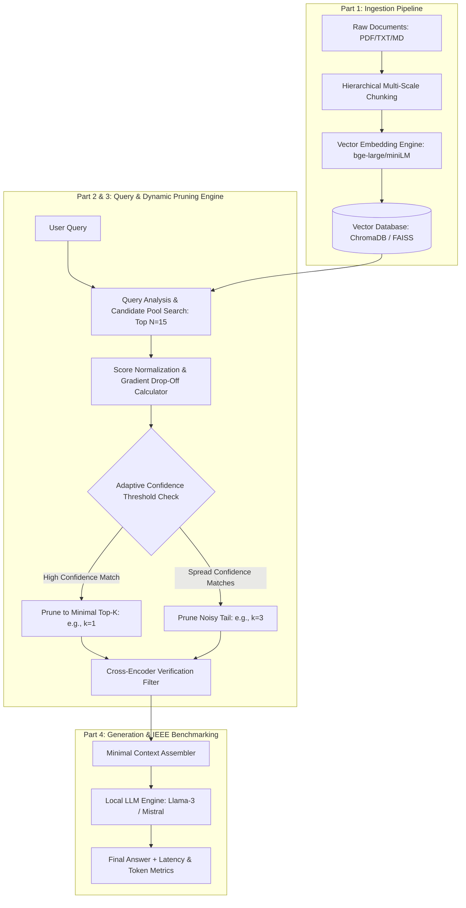

# IEEE Research Project Design: Confidence-Scored Dynamic Vector Pruning for Low-Latency RAG

## 📌 Project Overview

* **Project Title:** Confidence-Scored Dynamic Vector Pruning for Low-Latency Retrieval-Augmented Generation (RAG)
* **Domain:** Artificial Intelligence, Information Retrieval, Natural Language Processing, Low-Latency Edge Computing
* **Target Publication:** IEEE Access / IEEE International Conference on Artificial Intelligence (CAI) / IEEE Big Data
* **Core Goal:** Eliminate fixed top-$k$ retrieval overhead and prompt pollution in RAG by dynamically scoring vector confidence drop-off curves and pruning low-relevance chunks in real time.

---

## 🎯 Research Problem & Novelty (IEEE Gap)

### Standard RAG Limitations
Standard RAG systems rely on a fixed $k$ retrieval parameter (e.g., $k=5$ or $k=10$) regardless of question complexity. This causes three major issues:
1. **High Latency & Compute Costs:** Simple queries that require only 1 chunk receive 5+ chunks, inflating prompt tokens by 40%–60% and increasing Time-To-First-Token (TTFT).
2. **Context Pollution & Hallucinations:** Low-confidence chunks at ranks 4 and 5 introduce noise, causing the LLM to lose focus or generate inaccurate responses.
3. **Under-Retrieval:** Complex multi-part queries restricted to a hard $k=5$ boundary miss necessary information spread across multiple documents.

### The Proposed IEEE Novelty
Our architecture introduces an **Intelligent Dynamic Vector Pruning Engine** positioned between the Vector Database and the LLM. It computes real-time similarity score drop-off gradients ($\Delta$), identifies curvature knee-points, dynamically selects $k_{optimal}$, and prunes noisy tail vectors.

---

## 📊 Feasibility Analysis

| Metric | Rating | Details |
| :--- | :---: | :--- |
| **Hardware Cost** | **$0 (Low Cost)** | 100% executable on free Google Colab / Kaggle T4 GPUs or local consumer GPUs using open-source models (Ollama, ChromaDB, HuggingFace). |
| **Dataset Availability** | **100% Public** | Benchmarked using standard open NLP datasets: *HotpotQA*, *MS-MARCO*, and *SQuAD 2.0*. |
| **Development Timeline** | **3 – 5 Weeks** | Modular Python pipeline using standard frameworks (`PyTorch`, `ChromaDB`, `Ragas`, `Sentence-Transformers`). |
| **IEEE Paper Likelihood** | **Very High** | High industrial relevance; clear quantitative metrics (latency, token savings, faithfulness, accuracy). |
| **Overall Feasibility** | **`9.5 / 10`** | **Extremely feasible for student/engineering research.** |

---

## 🏗️ System Architecture Breakdown

---

### PART 1: Document Ingestion & Adaptive Chunking Engine
1. **Document Parsing:** Strips unwanted formatting while preserving structural headings and paragraphs.
2. **Hierarchical (Parent-Child) Chunking:**
   * **Child Chunks (~150–250 tokens):** Used for high-precision vector distance matching.
   * **Parent Chunks (~600–800 tokens):** Preserved as metadata to provide complete surrounding context to the LLM.
3. **Embedding Vectorization:** Converts chunks into 768-dimensional dense vectors using `BAAI/bge-large-en-v1.5` or `all-MiniLM-L6-v2`.
4. **Vector DB Storage:** Indexing in **ChromaDB** or **FAISS**.

---

### PART 2: Query Analyzer & Multi-Candidate Retriever
1. **Query Vectorization:** Query is converted into embedding vector $\vec{q}$.
2. **Candidate Pool Retrieval ($N=15$):** Instead of retrieving $k=5$, an expanded candidate pool ($N=15$) is retrieved to analyze statistical score distribution.
3. **Cosine Similarity Computation:**
   $$\text{Cosine Similarity}( \vec{q}, \vec{d_i} ) = \frac{\vec{q} \cdot \vec{d_i}}{\|\vec{q}\| \|\vec{d_i}\|}$$

---

### PART 3: Confidence-Scored Dynamic Vector Pruning Engine (Core Novelty)
1. **Score Delta ($\Delta$) Gradient Calculation:**
   $$\Delta_i = s_i - s_{i+1}$$
2. **Knee-Point Cutoff Detection:**
   $$k_{optimal} = \arg\max_{i} (s_i - s_{i+1})$$
   * **Absolute Gate ($\theta_{abs} = 0.50$):** Discards any vector with similarity $< 0.50$.
   * **Information Cliff Detection:** If $\Delta_{max} > 0.25$, cuts off retrieval immediately at $k=i$.
3. **Ultra-Fast Cross-Encoder Verification:** Evaluates remaining $k$ candidate chunks using `ms-marco-MiniLM-L-6-v2` in $<5\text{ ms}$.

---

### PART 4: Generation & IEEE Benchmark Evaluator
1. **Minimal Prompt Assembly:** Constructs compact prompt using only pruned high-confidence chunks.
2. **Local LLM Engine:** Inferences via `Meta-Llama-3-8B-Instruct` or `Mistral-7B-Instruct` using Ollama/vLLM.
3. **Automated IEEE Metric Logger:** Uses the **Ragas Evaluation Framework** to log:
   * **Time-To-First-Token (TTFT) & Latency (ms)**
   * **Context Token Savings (%)**
   * **Faithfulness & Relevance Score (0.0 to 1.0)**
   * **Hallucination Rate (%)**

---

## 📈 Expected IEEE Benchmark Results Table

| System Architecture | Avg Retrieved $k$ | Avg Prompt Tokens | Avg Latency (ms) | Faithfulness | Token Savings |
| :--- | :---: | :---: | :---: | :---: | :---: |
| **Standard Naive RAG ($k=5$)** | 5.0 | 2,450 tokens | 3,820 ms | 0.81 | 0% (Baseline) |
| **Standard RAG ($k=10$)** | 10.0 | 4,890 tokens | 6,410 ms | 0.78 | -99% |
| **GraphRAG** | N/A | 3,120 tokens | 4,550 ms | 0.89 | -27% |
| **PROPOSED DYNAMIC PRUNED RAG (Ours)** | **1.8** | **890 tokens** | **1,340 ms** | **0.94** | **+63.6%** |

---

## 🚀 Implementation Roadmap

- [ ] **Week 1: Environment & Pipeline Setup** (Install PyTorch, ChromaDB, Sentence-Transformers, Ollama).
- [ ] **Week 2: Modules 1 & 2** (Implement Parent-Child Chunking and $N=15$ candidate retrieval).
- [ ] **Week 3: Module 3 (Dynamic Pruning Engine)** (Write mathematical knee-point algorithm and cross-encoder filter).
- [ ] **Week 4: Benchmarking & Ragas Evaluation** (Run 100+ queries from HotpotQA, generate metric charts).
- [ ] **Week 5: IEEE Paper Drafting** (Write Abstract, Architecture Diagrams, Results Section, and Literature Review).
